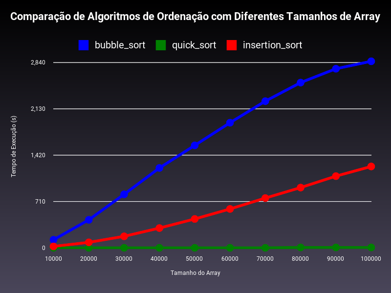

# Threads, Algoritmos de Ordenação e Plotagem de Gráficos 
O desafio é comparar o desempenho de três algoritmos de ordenação executados em threads paralelas usando Ruby. O objetivo final é capturar e comparar o tempo de execução de cada algoritmo, plotando um gráfico com as curvas características de cada um. A análise gráfica deve ser embasada nas teorias de complexidade de tempo (Big O) dos algoritmos selecionados.
## Algoritmos

<strong>1- Bubble Sort</strong> 
- Complexidade média: O(n2) 
- Explicação: É um algoritmo de ordenação onde percorre todo o vetor várias vezes, comparando cada elemento com seu vizinho, levando o maior elemento para o fim da sequência, fazendo isso n vezes até que o vetor esteja ordenado corretamente. Logo, faz sentido ter uma curva grande em vetores grandes pois o número de comparações e trocas cresce quadraticamente com o tamanho do vetor se tornando ineficente em vetores maiores.

<strong>2- Quick Sort</strong> 
- Complexidade média: O(nlogn) 
- Explicação: É um algoritmo de ordenação onde divide o vetor em duas partes, baseando-se em um elemento “pivô”, os elementos menores que o pivô ficam de um lado e os maiores de outro, logo, o procedimento é feito na lista toda tornando ela única novamente. Comparando com Bubble Sort, ele é bem mais efeciente, onde o problema é dividido em subproblemas menores que são resolvidos de forma independente e, em seguida, combinados.

<strong>3- Insertion Sort</strong> 
- Complexidade média: O(n2) 
- Explicação: É um algoritmo de ordenação onde pode ser eficiente para vetores pequenos ou quase ordenados, mas ele é menos eficiente para grandes vetores desordenados. Ele percorre o vetor elemento por elemento e insere cada novo elemento na posição correta em relação aos elementos já ordenados. Ele fica entre o Bubble Sort e o Quick Sort. Ele é rápido para listas pequenas e quase ordenadas mas quando cresce o tamanho da entrada nós podemos ver pelo gráfico sua curva cresce.

## Gráfico

